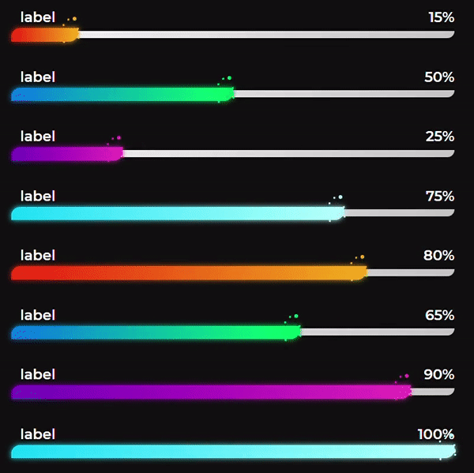

# React-Progressbar-Fancy

A fancy progressbar component, with modern design style.




## Installation

Install with npm:
- `npm install react-progressbar-fancy`.


or yarn:
- `yarn add react-progressbar-fancy`.


## Usage

Import the component with just one line of code

```javascript
import {ProgressBar} from "react-progressbar-fancy";
```

Now you can use the component:

```javascript
<ProgressBar score={25}/>
```


## Props

| Name                | Description                                                                                                                                                                                                                            |
| ------------------- | -------------------------------------------------------------------------------------------------------------------------------------------------------------------------------------------------------------------------------------- |
| `score`             | Progression value of the progressbar. Required.                                                                                                                                                          |
| `label`             | Label text of the progressbar. Default: `''`                                                                                                                                                                                       |
| `progressWidth`     | The width of the progressbar. Default: `500`.                                                                                                                                                                                      |
| `hideText`          | To show only progressbar and remove all text. Default: `false`.                                                                                                                                                                                    |
| `darkTheme`         | Change the color of the text to black. Default: `false`.                                                                                                                                                                                     |
| `progressColor`     | Some present gradient colors to choose from. `'red' , 'green' , 'blue' , 'purple'`. Default: `'red'`.                                                                                                                                        |
| `primaryColor`      | To add custom color for the progressbar. Advice to use both primaryColor and secondaryColor. Default: `''`.                                                                                                                                                                                 |
| `secondaryColor`    | To add custom color for the progressbar. Advice to use both primaryColor and secondaryColor. Default: `''`.                                                                                             |
| `disableGlow`       | Remove glow effect of the progressbar. Default: `false`.                                                                                                                                                         |

## Extras

You can take some inspiration for your custom gradient colors from `https://uigradients.com/`